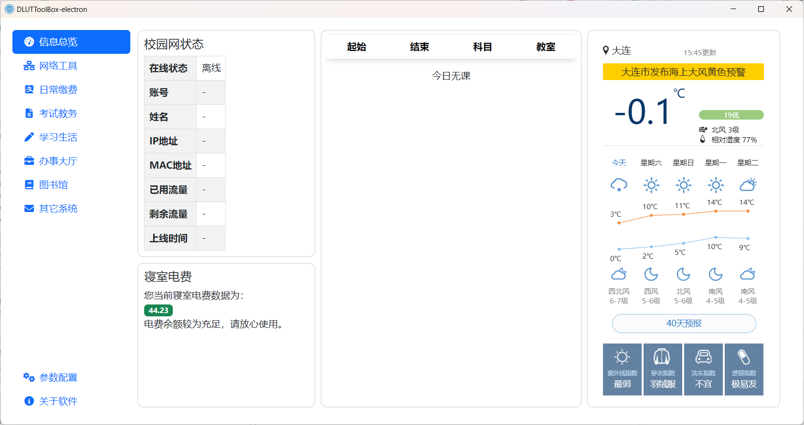
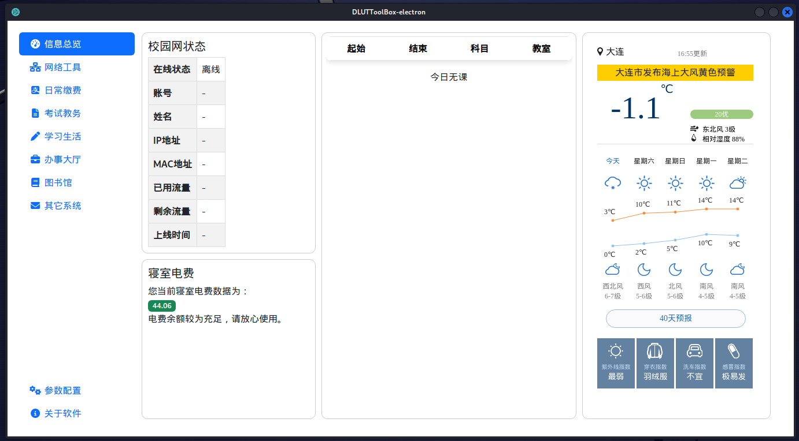
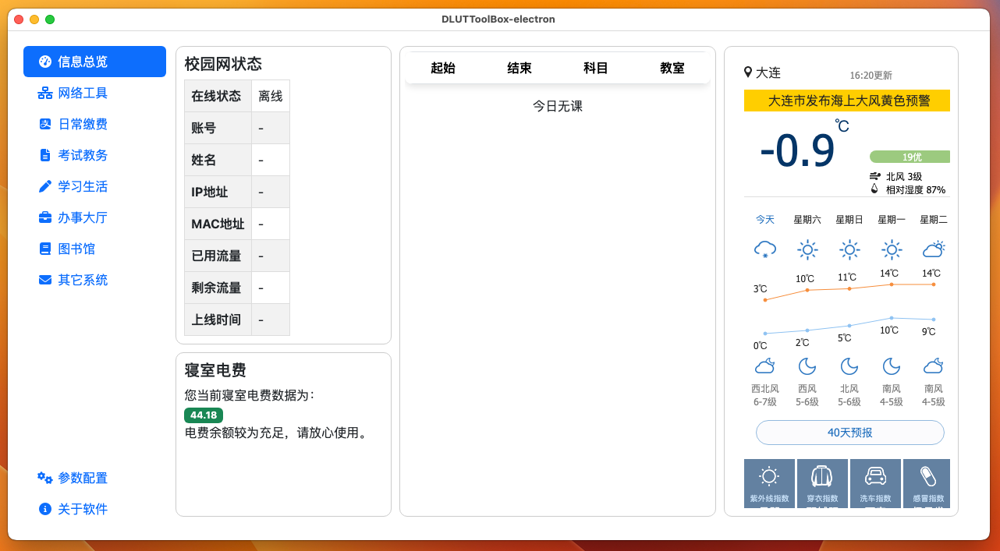
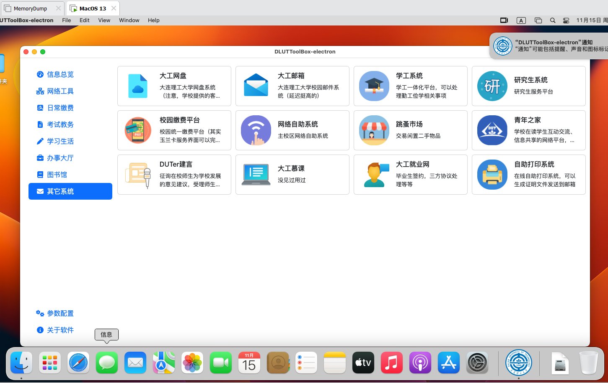

# DLUTToolBox-electron

为了支持多平台，于是乎对之前的工具箱使用electron进行重构。支持Windows、Linux、MacOS。目前除电费查询外的基本功能已经完成，正在打磨细节逐步完善中。。。。。。

苹果设备由于证书原因可能需要在访达中右键打开或加入信任列表（ps：我没有测试用的苹果设备，是在VMWare装的MacOS上测试的，更不可能有appleid和开发者帐号了。。）
### Windows

### Linux

### MacOS

